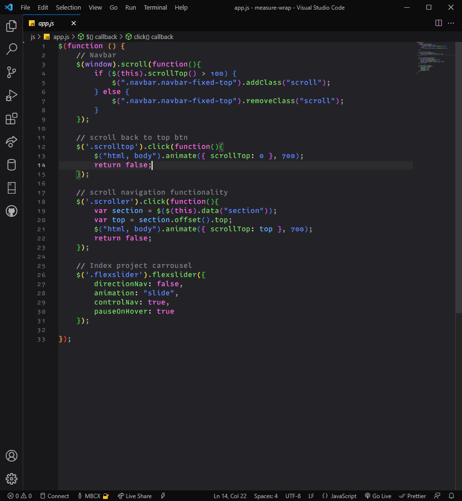
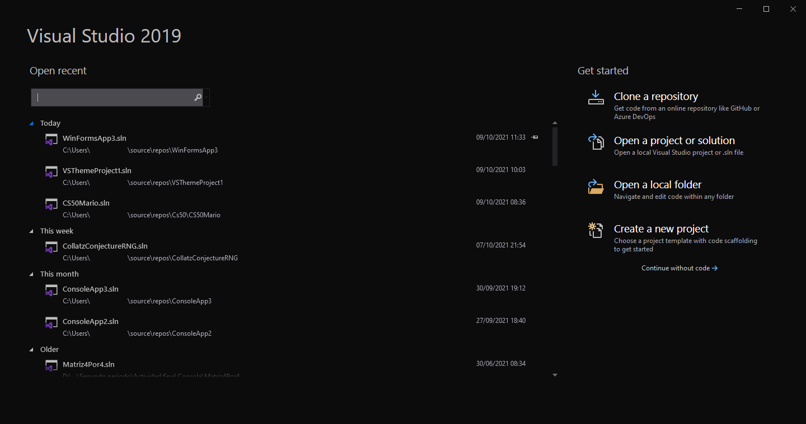

<h1 align="center">
    <strong> Firefox DevTools Colour Theme</strong>
</h1>
A quite pleasing-to-look at theme. An almost one-to-one recreation of the theme found in Mozilla Firefox's developer tools.
   

Intended for hours and hours of work. Try this theme yourself, and you'll never want to go back to other themes (at least I don't.)

<h2 align="center">
    Demo Images (VSCode)
</h2>

<h2 align="center">
    Demo Images (VS2019)
</h2>

Available for **Visual Studio Code** and **Visual Studio 2019**

_NOTE:_
_Only tested in **Visual Studio 2019**. Visual Studio 2017, 2015, 2013, 2011 or 2008 (if anyone still uses it) have not been tested. It may or may not work, I don't know._